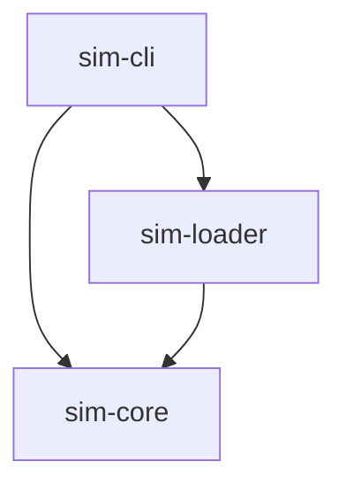

# LabWired Architecture

## High-Level Overview

The system is designed as a set of decoupled Rust crates to ensure portability and separation of concerns.

## Component Definitions

### `sim-core`
The heart of the emulation. It must be `no_std` compatible (eventually) or at least highly portable to allow for Wasm compilation (for the web version).

- **Traits**:
    - `Cpu`: Interface for processor execution (step, reset, interrupt).
    - `Bus`: Interface for memory map routing.
    - `Peripheral`: Interface for memory-mapped IO (read/write).
- **Modules**:
    - `Decoder`: Thumb-2 instruction decoding logic (e.g. `MOV`, `B`).
- **Structs**:
    - `Machine`: Container for CPU + Bus.

### `sim-loader`
Handles parsing of binary formats.

- **Responsibilities**:
    - Read ELF / Hex files.
    - Extract loadable segments.
    - Extract entry point.
    - Return a `ProgramImage` struct compatible with `sim-core`.

### `sim-cli`
The host runner.

- **Responsibilities**:
    - Parse command line args.
    - Initialize Logging (`tracing`).
    - Load the file using `sim-loader`.
    - Instantiate the `Machine` from `sim-core`.
    - Run the simulation loop.
    - Handle User Input / Signals.
