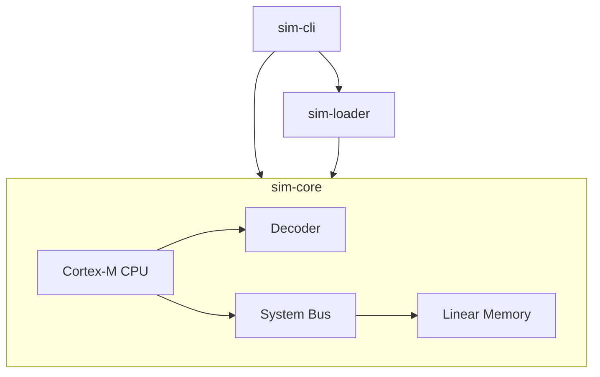

# LabWired Architecture

## High-Level Overview

The system is designed as a set of decoupled Rust crates to ensure portability and separation of concerns.



## Component Definitions

### 1. `sim-core`
The execution engine. Designed to be `no_std` compatible and **architecture-agnostic**.

#### **Pluggable Core Pattern**
The `Machine` struct is generic over the `Cpu` trait (`Machine<C: Cpu>`). This allows swapping the execution core (e.g., specific Cortex-M variants, RISC-V, etc.) without changing the bus or memory infrastructure.
The `Cpu` trait defines the minimal interface:
```rust
trait Cpu {
    fn reset(&mut self);
    fn step(&mut self, bus: &mut dyn Bus) -> SimResult<()>;
}
```

#### **Memory Model**

#### **Memory Model**
The system uses a `SystemBus` that routes memory accesses based on the address map:
- **Flash Memory**: `0x0000_0000` (Read-Only via Bus, writable by Loader) - Default 1MB.
- **RAM**: `0x2000_0000` (Read/Write) - Default 128KB.

The underlying storage is `LinearMemory`, a flat `Vec<u8>` optimized for direct access.

#### **CPU (Cortex-M Stub)**
Represents the processor state.
- **Registers**:
    - `R0-R12`: General Purpose
    - `SP (R13)`: Stack Pointer
    - `LR (R14)`: Link Register
    - `PC (R15)`: Program Counter
    - `xPSR`: Program Status Register
- **Execution Cycle**:
    1.  **Fetch**: Read 16-bit Opcode from `PC` via `Bus`.
    2.  **Decode**: Translate Opcode into `Instruction` enum via `Decoder`.
    3.  **Execute**: Update PC/Registers based on `Instruction`.

#### **Decoder (Thumb-2)**
A stateless module confirming to ARMv7-M Thumb-2 encoding.
**Supported Instructions (v0.2.0)**:
- **Control Flow**: `B <offset>`, `Bcc <cond, offset>` (Conditional), `BL` (Branch Link), `BX` (Branch Exchange).
- **Arithmetic**: `ADD`, `SUB`, `CMP`, `MOV`, `MVN`.
- **Logic**: `AND`, `ORR`, `EOR`.
- **Shifts**: `LSL`, `LSR`, `ASR` (Immediate).
- **Memory**:
    - `LDR`/`STR` (Immediate Offset)
    - `LDR` (Literal / PC-Relative)
    - `LDR`/`STR` (SP-Relative)
    - `PUSH`/`POP` (Stack Operations)
- **Other**: `NOP`

### 2. `sim-loader`
Handles binary parsing.
- Uses `goblin` to parse ELF files.
- Extracts `PT_LOAD` segments.
- Produces a `ProgramImage` containing segments and the Entry Point.

### 3. `sim-cli`
The host runner and entry point.
- **Initialization**: Sets up `tracing` and signal handling.
- **Loading**: Loads ELF into `Machine` memory (mapping segments to Flash/RAM).
- **Simulation**: Runs the `Machine::step()` loop.

